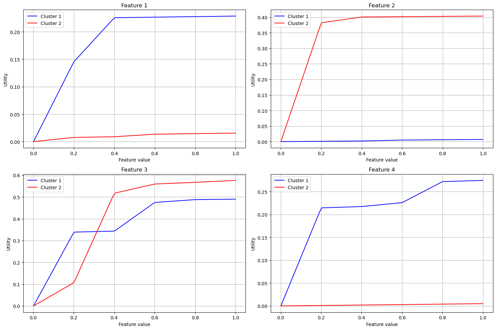

# Introduction

In this project, we explore preference learning, a key challenge in modern decision analysis and recommendation systems. Our focus is on learning utility functions from pairwise preferences using Mixed Integer Programming (MIP). The goal is to develop models that can effectively capture and predict decision-making patterns from observed preference data, particularly in scenarios where different groups of decision-makers may exhibit distinct preference behaviors.

Building upon the foundational UTA (UTilités Additives) method introduced by Jacquet-Lagrèze and Siskos[^1], our work extends the original approach to handle multiple preference clusters simultaneously. The UTA method provides a framework for inferring additive utility functions from preference rankings, and has become a cornerstone in multicriteria decision analysis.

The project is structured in three main parts:

1. Definition and formulation of a MIP model to learn piecewise-linear utility functions with multiple clusters
2. Implementation and analysis of the MIP model
3. Development of a heuristic approach for preference learning to handle larger-scale problems

Our approach builds upon the UTA (UTilités Additives) method while extending it to handle multiple preference clusters simultaneously.

# 1. Problem formulation

## Objective function

We seek to minimize :

$$
\min \sum_{k=1}^{K} \sum_{j=1}^{P} \sigma^k (j)
$$

## Decision variables

- $u_i^k(x_i^l) \geq 0$ : Continuous decision variable $\qquad \forall i \in [1,n], \quad \forall l \in [1,L], \quad \forall k \in [1,K]$
- $c_k^{(j)} \in \{0,1\}$ : Binary decision variable $\qquad \forall j \in [1,P], \quad \forall k \in [1,K]$

## Constraints

The problem is subject to the following constraints:

### Normalization constraints

$$
u_i^k(x_i^0) = 0 \quad \forall i \in [1,n], \forall k \in [1,K]
$$
$$
\sum_{i=1}^{n} u_i^k(x_i^L) = 1 \quad \forall k \in [1,K]
$$

### Monotonicity constraints

$$
u_i^k(x_i^{l+1})-u_i^k(x_i^{l}) \geq \epsilon \quad \forall l \in [0,L]
$$

### Preference constraints

$$
M(c_k^{(j)}-1) \leq \sum_{i=1}^{n} [u_i^k(x_i^{(j)}) - u_i^k(y_i^{(j)})] + \sigma^k (x^{(j)}) \leq Mc_k^{(j)} \quad \forall k \in [1,K], \forall j \in [1,P]
$$
$$
\sum_{k=1}^{K} c_k^{(j)} \geq 1 \quad \forall j
$$

### Domain constraints

$$
0 \leq u_i^k(x_i^l) \leq 1 \quad \forall i, \forall k, \forall l
$$
$$
c_k^{(j)} \in \{0,1\} \quad \forall j,  \forall k
$$

# 2. Implementation and Results

## 2.1 Model Implementation

It's an extension of UTA method considering clustering in addition.

The MIP model was implemented using the Pyomo optimization framework with CPLEX as the solver. It's an extension of UTA method considering clustering in addition.

## 2.2 Results and Visualization

Below are the visualization results showing the learned utility functions for each feature across different clusters:

# 3. Heuristic Approach

[To be completed]

[^1]: Jacquet-Lagrèze, E., & Siskos, J. (1982). Assessing a set of additive utility functions for multicriteria decision-making, the UTA method. European Journal of Operational Research, 10(2), 151-164.
