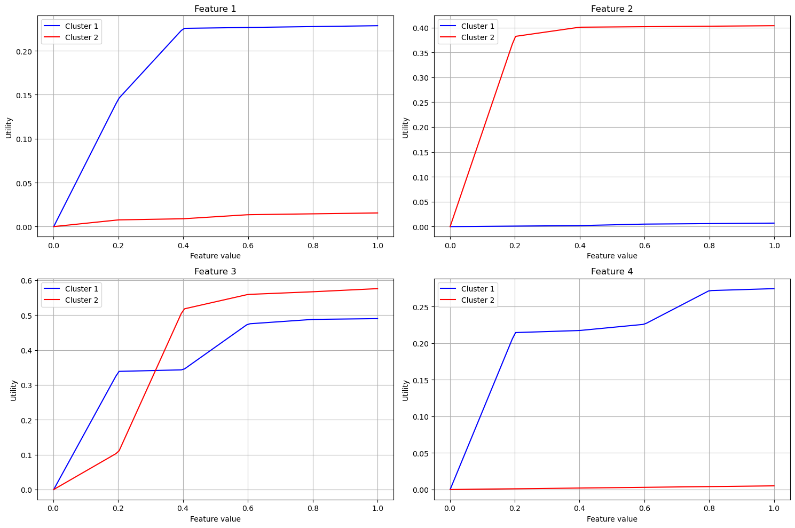
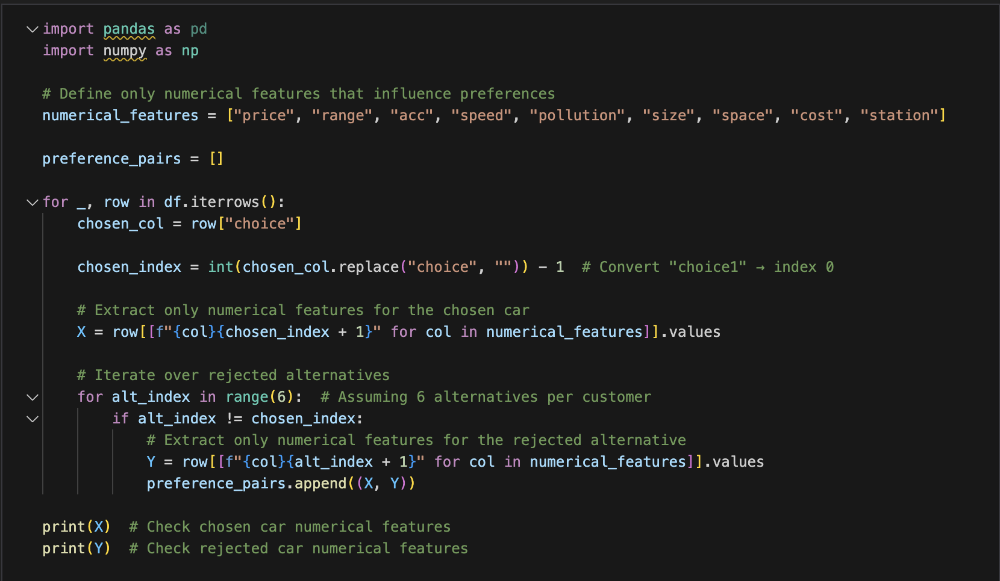
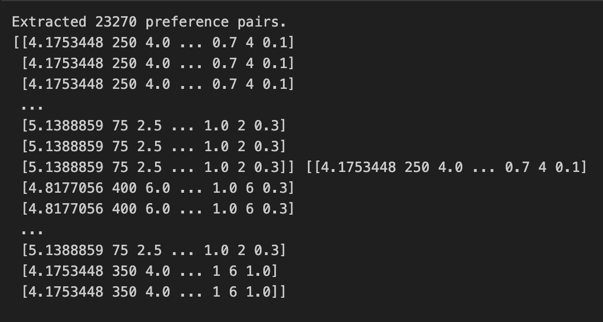
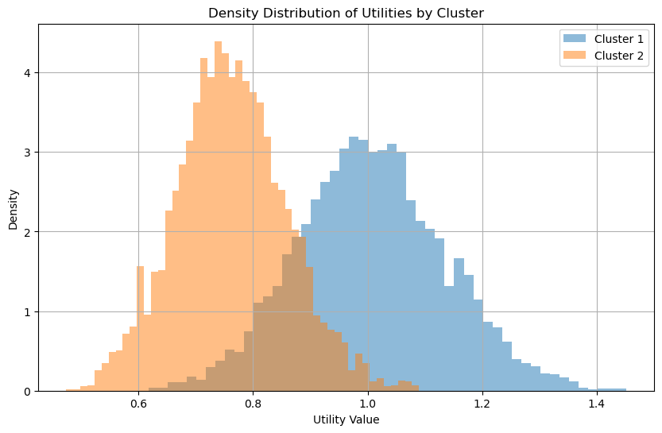
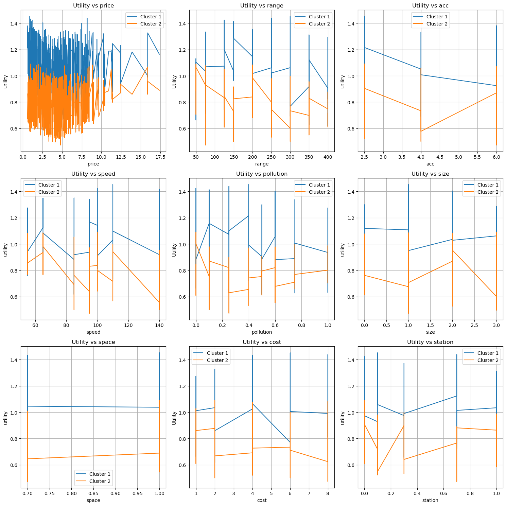

# Overview

## Project Focus
- Learning utility functions from pairwise preferences using MIP
- Extending UTA method for multiple preference clusters
- Developing heuristic approaches for larger problems

# Mathematical Formulation

## Mixed Integer Programming Model

**Objective Function:**

$$
\min \sum_{k=1}^{K} \sum_{j=1}^{P} \sigma^k (j)
$$

**Key Decision Variables:**

- $u_i^k(x_i^l)$ : Utility values
- $c_k^{(j)}$ : Cluster assignments

## Key Constraints

**Normalization:**

$$
\sum_{i=1}^{n} u_i^k(x_i^L) = 1 \quad \forall k \in [1,K]
$$

**Monotonicity:**

$$
u_i^k(x_i^{l+1})-u_i^k(x_i^{l}) \geq \epsilon \quad \forall l \in [0,L]
$$

**Preferences:**

$$
M(c_k^{(j)}-1) \leq \sum_{i=1}^{n} [u_i^k(x_i^{(j)}) - u_i^k(y_i^{(j)})] + \sigma^k (j) \leq Mc_k^{(j)}
$$

$$
\sum_{k=1}^{K} c_k^{(j)} \geq 1 \quad \forall j
$$

# Implementation Results

## Learned Utility Functions

# Heuristic Approach

## Key Ideas

1. **Randomly assigns initial clusters** to each preference pair.
2. **Computes utility functions** based on piecewise linear functions.
3. **Refines clusters iteratively** by minimizing the objective function.
4. **Stops when cluster assignments stabilize**, indicating convergence.

## Advantages
- Linear scaling with dataset size
- Independent of commercial solvers
- Efficient for large-scale problems

## How to transform data

{ width=80% }

## Results

{ width=80% }

## Learned Utility Functions

{ width=80% }

## Learned Utility Functions

{ width=60% }

## Contact Information
For more details, contact:
\
- clovis.piedallu@student-cs.fr
\
- basile.heurtault@student-cs.fr
\
- jeremy.mathet@student-cs.fr
